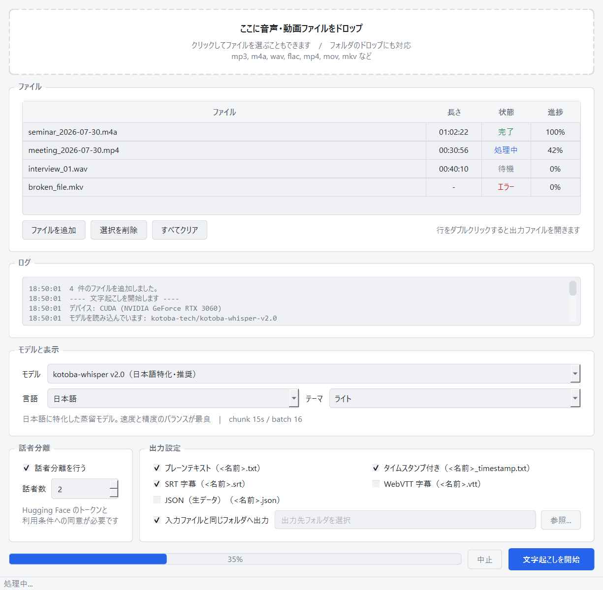
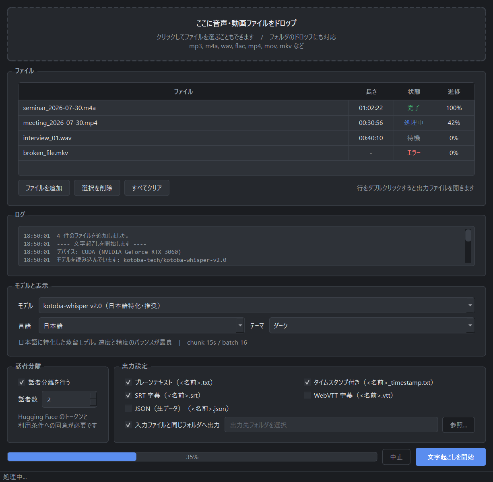

# Kotoba Transcriber

[kotoba-whisper](https://huggingface.co/kotoba-tech/kotoba-whisper-v2.0) をローカルで動かす、
Windows 向けの文字起こし GUI アプリです。音声・動画ファイルをドラッグ＆ドロップすると、
テキストや字幕に書き出します。

**音声もモデルも外部に送信しません。** すべて手元の PC で処理します。



<details>
<summary>ダークテーマ</summary>



</details>

## 特徴

- **ドラッグ＆ドロップ**でファイルを追加。フォルダごと・複数ファイルもまとめて処理
- **モデルを選べる** — kotoba-whisper v2.0 / v1.0、Whisper large-v3-turbo / large-v3 / medium、
  および Hugging Face のモデル ID を直接指定
- **話者分離**（[pyannote.audio](https://github.com/pyannote/pyannote-audio) 利用、要 HF トークン）
- **5 つの出力形式** — プレーンテキスト / タイムスタンプ付き / SRT / WebVTT / JSON
- **ライト・ダーク・システム追従**のテーマ
- **ffmpeg のインストール不要** — 音声デコードは PyAV が行う
- 長い音声でも進捗が進む。中断もできる

## 動作環境

| 項目 | 内容 |
| --- | --- |
| OS | Windows 10 / 11 |
| Python | 3.11 以降 |
| GPU | NVIDIA（CUDA）を推奨。なくても動くが 10 倍以上遅い |
| ディスク | 依存ライブラリ約 5GB + モデル約 1.5GB〜 |

開発・動作確認は Windows 11 / Python 3.13.9 / RTX 3060 12GB で行っています。
この構成では **177 秒の音声を約 7.5 秒**（およそ 25 倍速）で処理できました。

<details>
<summary>動作確認済みのバージョン</summary>

| パッケージ | バージョン |
| --- | --- |
| torch | 2.13.0+cu126 |
| torchaudio | 2.11.0+cu126 |
| transformers | 4.57.6 |
| PySide6 | 6.11.1 |
| av (PyAV) | 18.0.0 |
| pyannote.audio | 4.0.7 |

</details>

## インストール

リポジトリを取得して `setup.bat` を実行します。

```bat
git clone https://github.com/shioktools-kit/kotoba-transcriber.git
cd kotoba-transcriber
setup.bat
```

GPU の有無を判定したうえで、PyTorch の構成（CUDA 12.6 / CUDA 12.8 / CPU）を聞きます。
迷ったら CUDA 12.6 を選んでください。プロンプトを飛ばしたい場合は引数で指定できます。

```bat
setup.bat cu126
setup.bat cpu
```

仮想環境は `%USERPROFILE%\.venvs\kotoba-transcriber` に作られます。
リポジトリの中ではなくホームディレクトリに置くのは、PyTorch だけで数 GB あるため、
OneDrive や Google ドライブなど同期されるフォルダに置くと問題が起きやすいからです。

## 起動

```bat
run.bat
```

ウィンドウが出るまで 2 秒ほどです。初回の文字起こし実行時に、選んだモデルが
`%USERPROFILE%\.cache\huggingface` へダウンロードされます（既定のモデルで約 1.5GB）。
2 回目以降はローカルから読み込みます。

`run.bat` は `pythonw.exe` で起動するのでコンソールは出ません。起動に失敗した場合は
ダイアログで通知し、詳細を `%LOCALAPPDATA%\KotobaTranscriber\error.log` に書き出します。
コンソールを残して見たいときは `run_debug.bat` を使ってください。

## 使い方

1. 画面上部のエリアにファイルをドロップする（クリックして選択、フォルダのドロップも可）
2. モデル・言語・テーマ、話者分離、出力形式を設定する
3. 「文字起こしを開始」を押す
4. 一覧の行をダブルクリックすると出力ファイルが開く

設定はウィンドウを閉じるときに保存され、次回起動時に復元されます。

### モデル

一覧から選びます。末尾の「その他（モデル ID を直接入力）...」を選ぶと入力欄が開き、
Hugging Face のモデル ID を直接指定できます。指定した ID は一覧に追加され、次回も復元されます。

| モデル | 用途 |
| --- | --- |
| kotoba-whisper v2.0 | 日本語特化の蒸留モデル。速度と精度のバランスが最良（既定） |
| kotoba-whisper v1.0 | v2.0 の前世代。比較用 |
| Whisper large-v3-turbo | 多言語対応で高速 |
| Whisper large-v3 | 最高精度だが最も重い |
| Whisper medium | VRAM が少ない環境向け |

`chunk_length_s` と `batch_size` はモデルごとに切り替わります（蒸留モデルは 15 秒、
本家 Whisper は学習時と同じ 30 秒）。定義は `kotoba_transcriber/config.py` の `MODELS` です。

### 出力形式

| 形式 | ファイル名 | 内容 |
| --- | --- | --- |
| プレーンテキスト | `<名前>.txt` | 本文のみ。句点で改行（話者分離時は話者ごとの段落） |
| タイムスタンプ付き | `<名前>_timestamp.txt` | `[00:01:23] 話者1: 発言内容` |
| SRT 字幕 | `<名前>.srt` | 動画への字幕付け用 |
| WebVTT 字幕 | `<名前>.vtt` | Web プレイヤー用 |
| JSON | `<名前>.json` | 区間・時刻・話者を含む生データ |

同名ファイルがある場合は `<名前> (2).txt` として退避します。

### 話者分離

pyannote.audio で話者を推定し、各発話に「話者1」「話者2」…を割り当てます。
**Hugging Face の準備が必要です。**

1. 次の **3 つ**のページで利用条件に同意する（無料、アカウントは必要）
   - <https://huggingface.co/pyannote/speaker-diarization-3.1>
   - <https://huggingface.co/pyannote/segmentation-3.0>
   - <https://huggingface.co/pyannote/speaker-diarization-community-1>
2. <https://huggingface.co/settings/tokens> で read 権限のトークンを作る
   （fine-grained で作る場合は
   「Read access to contents of all public gated repos you can access」を含める）
3. トークンを設定する（PowerShell）

```powershell
& "$env:USERPROFILE\.venvs\kotoba-transcriber\Scripts\hf.exe" auth login
```

環境変数 `HF_TOKEN` にトークンを入れても構いません。**トークンはアプリ内に保存しません。**

> [!IMPORTANT]
> **3 つ目を忘れやすいので注意してください。** pyannote.audio 4.x は
> `speaker-diarization-3.1` を読むとき、内部で community-1 の資産
> （`plda/xvec_transform.npz`）も取得します。1 つでも未同意だと `GatedRepoError: 403`
> になります。`hf auth whoami` が通っていても、**モデルのメタ情報は見えてファイルだけ
> 403** になるため、権限があるように見えて紛らわしいです。

「話者数」を 0（自動推定）以外にすると、その人数を前提に推定します。人数が分かっている
場合はそのほうが安定します。

準備ができていない状態で話者分離を ON にすると、**警告ダイアログを出したうえで
話者分離だけ無効にして文字起こしは続行**します。出力に `話者1:` が付いているかどうかで、
実際に動いたか判別できます。

## うまくいかないとき

| 症状 | 対処 |
| --- | --- |
| 起動しない・何も出ない | `%LOCALAPPDATA%\KotobaTranscriber\error.log` を見る。`run_debug.bat` ならコンソールにも出る |
| `cuda available: False` | GPU ドライバを更新するか、`setup.bat cu128` など別の CUDA で入れ直す |
| CUDA out of memory | `kotoba_transcriber/config.py` の該当モデルの `batch_size` を下げる |
| 音声トラックが見つかりません | 動画に音声が入っていない、または未対応コーデック |
| 話者分離が有効にならない | 上の「話者分離」の手順、特に 3 つ目のページの同意を確認 |

解決しない場合は [Issues](https://github.com/shioktools-kit/kotoba-transcriber/issues) へ
`error.log` の内容とあわせて報告してください。

## 構成

```
main.py                     エントリポイント
kotoba_transcriber/
├── config.py               設定値（モデル一覧・出力形式・分割長など）
├── audio.py                PyAV で 16kHz モノラル化、無音位置での分割
├── transcriber.py          transformers pipeline のロードと推論
├── diarization.py          pyannote による話者分離と話者ラベルの割り当て
├── formatters.py           テキスト / SRT / VTT / JSON への整形
├── worker.py               別スレッドでのバッチ処理
├── compat.py               依存ライブラリの噛み合わせ対策（torchcodec）
├── qtfix.py                PySide6 の DLL 衝突対策（パッケージ読み込み時に実行）
└── ui/
    ├── main_window.py      メインウィンドウ
    ├── drop_area.py        ドラッグ＆ドロップ領域
    └── styles.py           配色・QSS・QPalette（色定義はここだけ）
```

長い音声は 5 分前後に分割してから pipeline へ渡します。進捗を出すためと、VRAM 使用量を
一定に保つためです。分割位置は目標地点の前後 15 秒を探索して**最も静かな場所**へ寄せるので、
語の途中で切れにくくなっています。中断は区間境界で効くため、押してから実際に止まるまで
最大数十秒かかります。

## ライセンス

MIT License（[LICENSE](LICENSE)）

このアプリが利用しているモデル・ライブラリは、それぞれのライセンスに従います。

| 依存 | ライセンス |
| --- | --- |
| [kotoba-whisper](https://huggingface.co/kotoba-tech/kotoba-whisper-v2.0) | Apache-2.0 |
| [Whisper](https://github.com/openai/whisper) | MIT |
| [pyannote.audio](https://github.com/pyannote/pyannote-audio) | MIT（モデルは利用条件への同意が必要） |
| [PySide6 / Qt](https://www.qt.io/qt-for-python) | LGPL-3.0 |
| [PyAV](https://github.com/PyAV-Org/PyAV) | BSD-3-Clause |

---

## English

A Windows desktop GUI for local speech-to-text using
[kotoba-whisper](https://huggingface.co/kotoba-tech/kotoba-whisper-v2.0)
(a Japanese-specialised distilled Whisper). Drag and drop audio or video files and get
plain text, timestamped text, SRT, WebVTT, or JSON. Optional speaker diarization via
pyannote.audio. Everything runs locally — no audio leaves your machine.

The UI and documentation are in Japanese, since the default model targets Japanese.
Other Whisper models (multilingual) can be selected from the model dropdown.

Run `setup.bat` (creates a virtualenv and installs PyTorch for your GPU), then `run.bat`.
